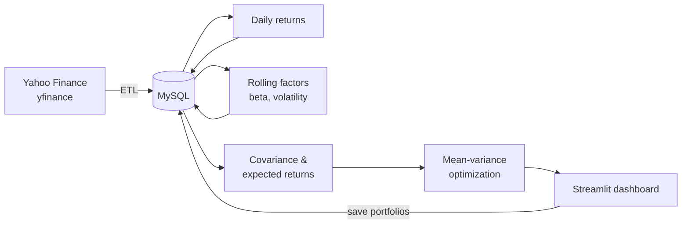

# Multi-Factor Investment Portfolio Analysis

An end-to-end portfolio analytics project: it collects market data, stores it in a relational database, computes returns and risk factors, optimizes portfolio weights with classic mean-variance techniques, and serves the results through an interactive Streamlit dashboard.

> **Disclaimer:** this is an educational project. Nothing here is investment advice.

## What it does

- **ETL** — downloads daily prices for a configurable set of tickers (default: 10 US large-caps and ETFs) from Yahoo Finance and upserts them into MySQL.
- **Returns** — computes daily simple returns from stored prices.
- **Factors** — computes rolling risk factors per asset: 60-day beta versus the market (SPY) and 60-day volatility.
- **Optimization** — builds Minimum-Volatility and Maximum-Sharpe portfolios (SciPy SLSQP) with long-only constraints and a configurable per-asset weight cap.
- **Dashboard** — interactive Streamlit app with a correlation heatmap, optimized weights, an approximate efficient frontier, a historical backtest (CAGR, annualized volatility, Sharpe, max drawdown), CSV export, and saving portfolios back to the database.

## Architecture



All pipeline stages read from and write back to MySQL through SQLAlchemy, using idempotent upserts (`INSERT ... ON DUPLICATE KEY UPDATE`), so every step can be re-run safely.

## Project structure

```
├── dashboard/
│   └── app.py                     # Streamlit dashboard
├── database/
│   ├── create.sql                 # creates the database and app user
│   └── src/
│       ├── connection.py          # SQLAlchemy engine, configured via .env
│       └── create_db_schema.py    # creates all tables
├── notebooks/
│   └── portfolio_analysis.ipynb   # exploratory analysis
├── src/
│   ├── data_collection.py         # ETL: prices from yfinance → MySQL
│   ├── returns_calculation.py     # daily returns → MySQL
│   ├── factors_calculation.py     # rolling beta & volatility → MySQL
│   ├── risk/
│   │   ├── covariance.py          # covariance matrix & expected returns
│   │   └── optimization.py        # min-vol and max-Sharpe optimizers
│   └── utils.py                   # plotting helpers
├── .env.example
└── requirements.txt
```

## Database schema

| Table | Contents |
|---|---|
| `assets` | ticker, name, sector |
| `historical_prices` | daily close and volume per asset |
| `returns` | daily simple returns per asset |
| `factors` | rolling beta and volatility per asset |
| `portfolio_weights` / `portfolio_weight_rows` | saved portfolios and their weights |

Price, return, and factor tables enforce `UNIQUE (asset_id, date)`, which is what makes the upsert-based pipeline idempotent.

## Getting started

### Prerequisites

- Python 3.11+
- MySQL 8 running locally

### 1. Install dependencies

```bash
git clone <repo-url>
cd Multi-factor-Investment-Portfolio-Analysis
python -m venv .venv
source .venv/bin/activate        # Windows: .venv\Scripts\activate
pip install -r requirements.txt
```

### 2. Set up the database

Edit the password in [database/create.sql](database/create.sql), then:

```bash
mysql -u root -p < database/create.sql
```

Copy the environment template and fill in your credentials:

```bash
cp .env.example .env
```

Create the tables:

```bash
python -m database.src.create_db_schema
```

### 3. Run the pipeline

From the repository root, in order:

```bash
python -m src.data_collection       # fetch prices (2015 → today by default)
python -m src.returns_calculation   # compute daily returns
python -m src.factors_calculation   # compute rolling beta & volatility
```

The ticker universe is defined in [src/data_collection.py](src/data_collection.py); the date range can be overridden with `PRICE_START_DATE` / `PRICE_END_DATE` in `.env`.

### 4. Launch the dashboard

```bash
streamlit run dashboard/app.py
```

Then open http://localhost:8501, pick a ticker subset, date window, optimization method, and weight cap, and explore the resulting portfolio.

## Tech stack

Python · pandas · NumPy · SciPy · SQLAlchemy · MySQL · yfinance · Streamlit · Plotly · Matplotlib/Seaborn

## Possible extensions

- Covariance shrinkage (Ledoit–Wolf) as an alternative to the sample estimator
- Factor-based risk attribution using the stored beta/volatility factors
- Out-of-sample backtesting with periodic rebalancing
- Unit tests and CI
